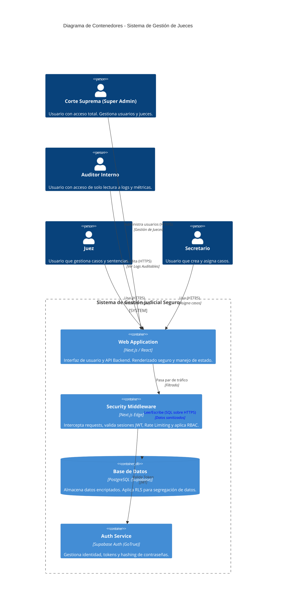

**ESCUELA POLITÉCNICA NACIONAL**
**DESARROLLO DE SOFTWARE SEGURO**
**INFORME: ÍNDICE DE ENTREGABLES DEL PROYECTO**
**GRUPO 4**

**INTEGRANTES:**
* JHON MEZA
* DAMARYS OÑA
* STUART PALMA
* JUAN JOSÉ PROAÑO

**FECHA:** 17/1/2026
**PhD. Jhonattan Barriga**

---

# Diagrama de Arquitectura de Seguridad (Modelo C4)

Este documento describe la arquitectura del sistema con énfasis en los componentes de seguridad.

## Diagrama de Contenedores (Mermaid)

## Descripción de Componentes

1.  **Web Application (Next.js)**:
    *   **Función**: Servir la interfaz de usuario y procesar lógica de negocio en Server Actions.
    *   **Seguridad**: Escapado automático de React (XSS), validación de esquemas Zod.

2.  **Security Middleware**:
    *   **Función**: Primera línea de defensa.
    *   **Seguridad**: Rate Limiting (DoS protection), Validación de Sesión, Enrutamiento seguro.

3.  **Supabase Auth**:
    *   **Función**: Proveedor de Identidad.
    *   **Seguridad**: Manejo de estándares seguros (JWT, bcrypt), no expone contraseñas al backend de aplicación.

4.  **Base de Datos (PostgreSQL)**:
    *   **Función**: Persistencia.
    *   **Seguridad**: **RLS (Row Level Security)** es el núcleo. Aunque la API se vea comprometida, la BD no retornará filas que el usuario (`auth.uid()`) no tenga permiso de ver.
